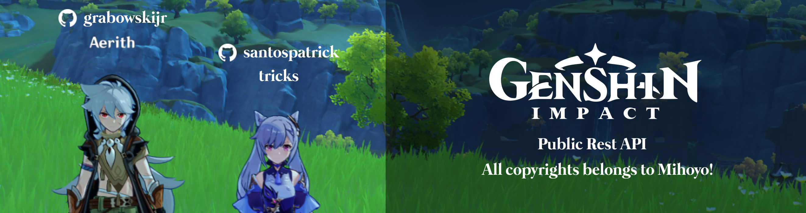

# genshin-api
Genshin public REST API serving data from a Web Scraping approach

## Roadmap

| Feature              | Endpoint                   | Status          |
|----------------------|----------------------------|-----------------|
| Puppeteer Setup      | -                          | :no_entry_sign: |
| Database Setup       | -                          | :no_entry_sign: |
| Authentication Setup | POST /api/v1/login         | :no_entry_sign: |
| Characters List      | GET /api/v1/characters     | :no_entry_sign: |
| Character Details    | GET /api/v1/characters/:id | :no_entry_sign: |